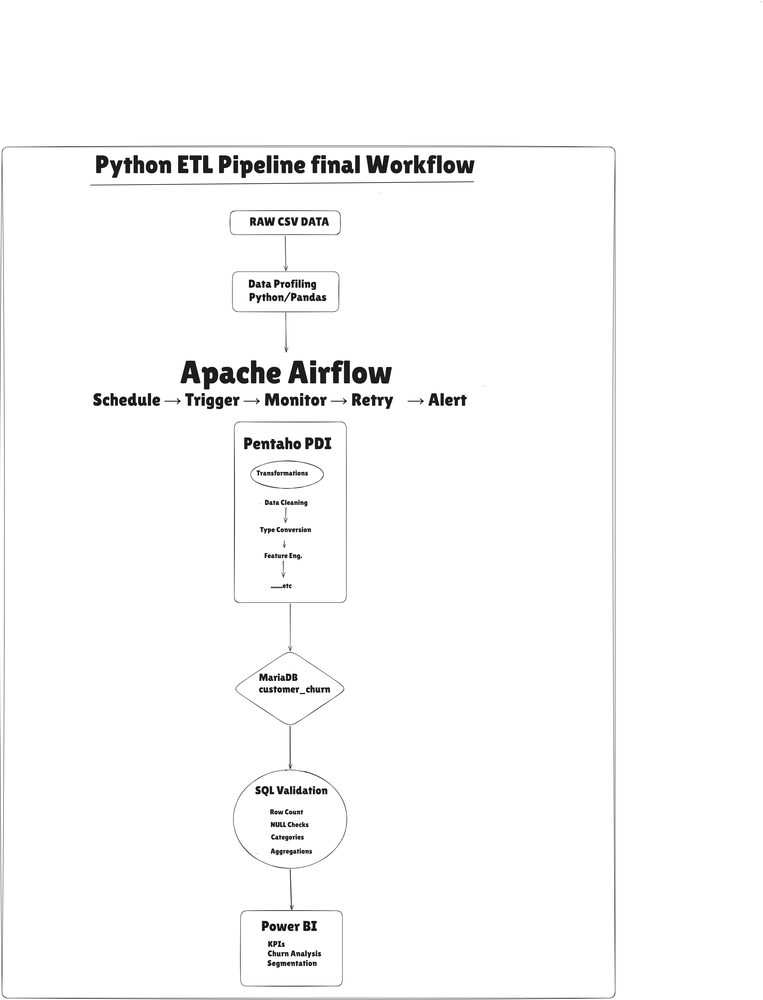

# Telecom Customer Churn - End-to-End ETL Pipeline

An enterprise-style Data Engineering and Analytics pipeline designed to predict, analyze, and visualize customer churn for a telecommunications provider. This project orchestrates data extraction, transformation, quality validation, and business intelligence reporting.

---

## Architecture Overview



```
[ Raw CSV Data ] 
       │
       ▼
1. EXPLORATION & PROFILING ───> Python (EDA, Null checks, Distributions)
       │
       ▼
2. ETL TRANSFORMATION      ───> Pentaho Data Integration (PDI / Kettle)
       │                         • Type Casting, Null Imputation, Cleansing
       ▼
3. ORCHESTRATION & RESILIENCE > Apache Airflow (Dockerized CeleryExecutor)
       │                         • OpenSSH Bridge to Windows Host (ED25519)
       │                         • Pre-flight prerequisite validations
       │                         • Automated Retries (2 retries, 1.5 min delay)
       ▼
4. WAREHOUSING             ───> MariaDB / MySQL (Curated Data Layer)
       │
       ▼
5. BI & VISUALIZATION      ───> Power BI Executive Dashboard (.pbix)
```

---

## Project Structure

```text
telecom-customer-churn/
│
├── .gitignore
├── README.md
├── requirements-test.txt
│
├── airflow/
│   ├── dags/
│   │   └── telecom_churn_dag.py
│   ├── .env.example
│   ├── docker-compose.yaml
│   └── Dockerfile
│
├── data/
│   └── customer_churn.csv
│
├── docs/
│   ├── architecture.png
│   ├── ETL_documentation.md
│   └── testing.md
│
├── pentaho/
│   ├── transformations/
│   │   └── Transformation 1.ktr
│   └── jobs/
│
├── powerbi/
│   └── Telecom_Customer_Churn.pbix
│
├── python/
│   └── data_profiling.py
│
├── sql/
│   ├── create_tables.sql
│   └── validation_queries.sql
│
└── tests/
    └── test_dag_integrity.py
```

---

## Tech Stack

| Component | Technology | Purpose |
| :--- | :--- | :--- |
| **Orchestration** | Apache Airflow 3 | Workflow scheduling, DAG dependency management, monitoring |
| **Containerization** | Docker & Docker Compose | Multi-service Airflow cluster (Scheduler, Worker, Redis, Postgres) |
| **ETL Engine** | Pentaho Data Integration (PDI 10.2) | High-throughput data cleansing, type conversions, table output |
| **Storage / Warehouse** | MariaDB / MySQL | Relational data store for structured customer records |
| **Visualization** | Power BI Desktop | Executive reporting, churn rate analysis, cohort tracking |
| **Security Bridge** | Windows OpenSSH (ED25519) | Secure container-to-host execution bridge |
| **Testing** | PyTest & SQL Assertions | DAG integrity testing and database quality checks |

---

## Step-by-Step Setup & Execution

### 1. Database Setup
Execute the DDL script to create the target schema and tables:
```bash
mysql -u root -p < sql/create_tables.sql
```

### 2. Start the Airflow Cluster
Navigate to the Airflow directory and start containers:
```powershell
Set-Location "airflow"
docker compose up -d
```

### 3. Trigger the Pipeline
Access the Airflow Web UI at `http://localhost:8080`:
* **Username:** `airflow`
* **Password:** `******`
* Trigger the DAG: `telecom_churn_etl`

### 4. Run Data Quality Validations
Verify loaded row counts and distribution:
```bash
mysql -u root -p < sql/validation_queries.sql
```

### 5. Launch Power BI Dashboard
Open [`powerbi/Telecom_Customer_Churn.pbix`](powerbi/Telecom_Customer_Churn.pbix) in Power BI Desktop to inspect the visualizations and churn KPIs.

---

## Key Features & Production Resilience

* **Fail-Fast Prerequisite Checks**: Before launching the transformation engine, Airflow verifies that the input dataset, PDI runner (`Pan.bat`), and `.ktr` files exist on the host.
* **Automated Failure Recovery**: Configured with `retries: 2` and a `retry_delay: 1.5 minutes` to gracefully recover from temporary network or host resource contention.
* **Separation of Concerns**: Lightweight containerized orchestration manages host-native data transformation tools without unnecessary container bloat.
